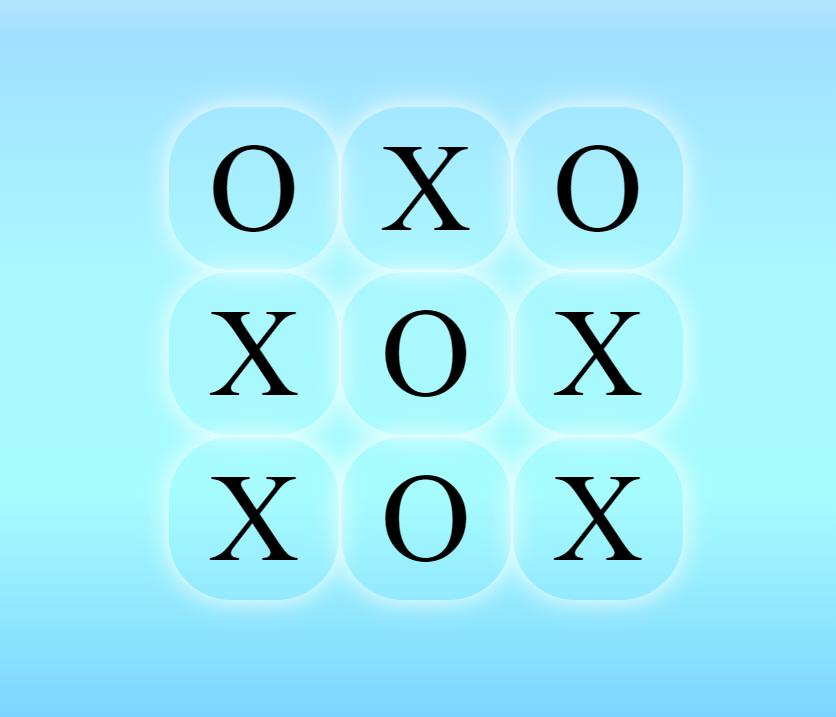
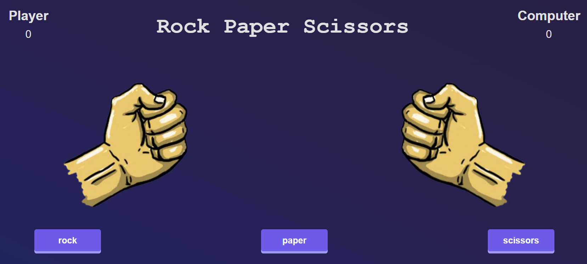
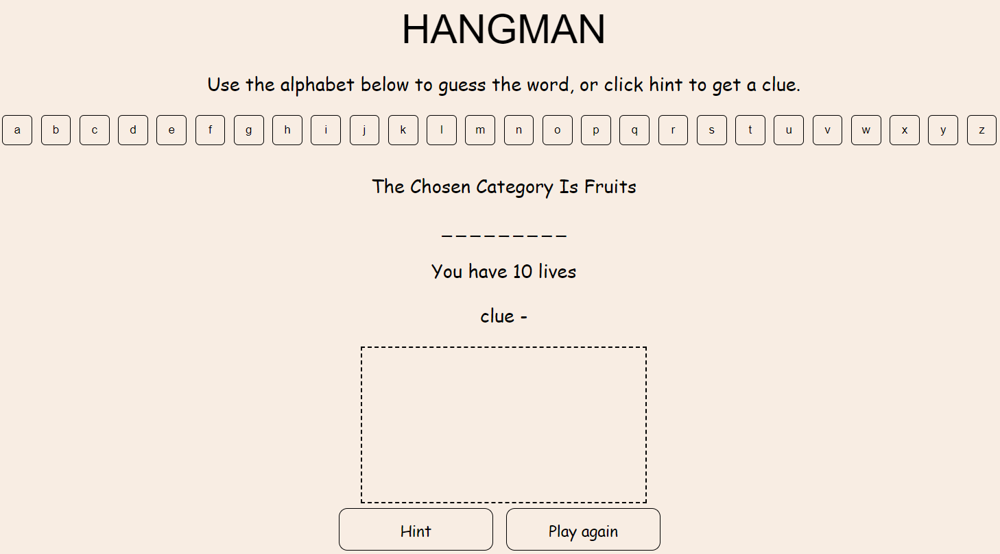
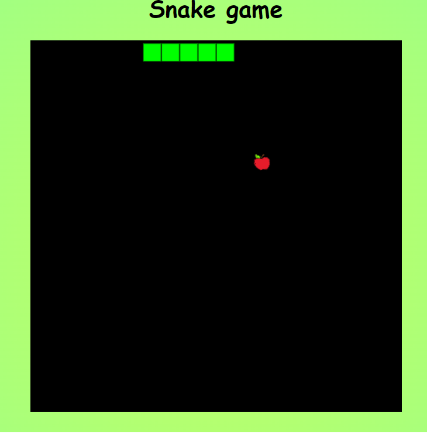

# Flytimegames
 е уебсайт със игри които вески от нас познава. Направен е със html, css и javascript и съдържа игрите:
 ## Морски шах 

 
###### Може да се играе със приятел(1vs1) или срещу компютър(за играта срещу компютър е използван минимакс алгоритъм)

 ## Камък, ножица, хартия
 
 

###### играе се срещу компютър(компютърът избира на случеан принцип) 
 
 
 ## Бесеница 
  
 

 ###### Може да се играе на български и английски 
 Избира на случаен принцип дума от следните категорийте:
- Астрономия
- Животни
- Плодове
- Столици
 
###### За всяка от думите има подзказка 
 
 
 ## Дино игра
  
 
 ###### Динозавъра трябва да прескача кактусите(те се генерират на случаен принцип и колкото по голям е кактуса толкова по малка е вероятността да се падне). Колкото по дълго се играе толкова по бързо става.
 
 ## Змия
  
 
 ###### На игралното поле се появяват ябълки на различни места. Със всяка изядена ябълка змията става с 1 по дълга и резултатът се увеличава. Ако се удари във стените или във себе си играта свършва.
 

## Игра за памет
  
 
###### Съдържа 12 карти(6 двойки карти). Целта е да се запомни коя карта къде се намира и да се обърнат всички карти със възможно най малко ходове.

---
 
 ### *[Линк за сайта](https://flytimegames.netlify.app/)*. 
 
